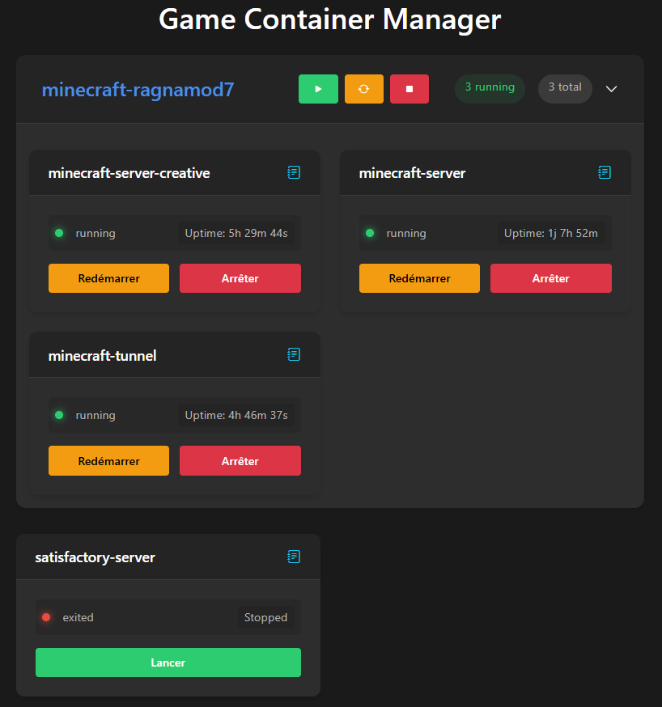

# GameContainerManager

It's a docker image based on Python 3.9 that allow to do the first maintenance of your docker's *games* containers

Container 3 services:
  - Backend: Who will interact with your local docker instance
  - Frontend: Who will display the web interface
  - Bot: Who gives you the possiblity to manage your container from discord text channel

Backend is mandatory, Frontend or Bot are not necessary together but complementary

## How to deploy it ?

⚠️**You need to build the image localy**⚠️ there is no image available on registry

To build image locally, run: 

`docker build --pull --rm -f 'PATH/OF/YOUR/FOLDER/Dockerfile' -t 'gamecontainermanager:latest' 'PATH/OF/YOUR/FOLDER'`

To see it you can run `docker image ls`

| REPOSITORY | TAG | IMAGE ID | CREATED | SIZE |
|------------|-----|----------|---------|------|
| gamecontainermanager | latest | 195ae66bdf6a | About a minute ago | 182MB |

Fill a file `.env` at the root of `PATH/OF/YOUR/FOLDER` with desired vars (see below) and deploy services

## Variables
| Name | Service Assosiate | Mandatory | Default Value | Value Possible| UTILITIES |
|------|-------------------|-----------|---------------|---------------|-----------|
| DOCKERCONTAINERMANAGER_BACKEND_URL | bot, frontend | ✅ | http://backend:5000 | *http://your.service.name:5000* | Url for your backend container (can be in docker's local network) |
| DOCKERCONTAINERMANAGER_DEBUG | All | ❌ | False | `False` // `True` | Enable debug logs level |
| DOCKERCONTAINERMANAGER_DISCORD_TOKEN | bot | ✅ | False | *YOUR_DISCORD_TOKEN* | Discord auth token for bot, see (Discord doc)[https://discord.com/developers/docs/intro] |
| DOCKERCONTAINERMANAGER_FRONTEND_URL | bot, frontend | ❌ | **NONE** | *https://your.domain.com* | Frontend service public address is reachable |
| DOCKERCONTAINERMANAGER_SERVICE_TYPE | backend, bot, frontend | ✅ | **NONE** | `backend`, `bot`, `frontend` | service name that you want run |

## Examples

### Light Version

    services:
      frontend:
        image: gamecontainermanager:latest
        environment:
          DOCKERCONTAINERMANAGER_SERVICE_TYPE: frontend
        ports:
          - "5000:5000"

      backend:
        image: gamecontainermanager:latest
        environment:
          DOCKERCONTAINERMANAGER_SERVICE_TYPE: backend
          - /var/run/docker.sock:/var/run/docker.sock:ro

    ## Application Example ##
      app:
        image: your/app:image
        labels:
      gamecontainermanager.enable: true
          .....

### Full Version

    services:
      frontend:
        image: gamecontainermanager:latest
        environment:
          DOCKERCONTAINERMANAGER_SERVICE_TYPE: frontend
        ports:
          - "5000:5000"

      backend:
        image: gamecontainermanager:latest
        environment:
          DOCKERCONTAINERMANAGER_SERVICE_TYPE: backend
        volumes:
          - /var/run/docker.sock:/var/run/docker.sock:ro

      bot:
        image: gamecontainermanager:latest
        environment:
          DOCKERCONTAINERMANAGER_FRONT_URL: 'https://games-manager.example.com' # Frontend service's public URL
          DOCKERCONTAINERMANAGER_DISCORD_TOKEN: "PUT YOUR DISCORD TOKEN HERE" # Need to be set // Can be put in docker secret to avoid exposing the token
          DOCKERCONTAINERMANAGER_SERVICE_TYPE: bot

    ## Application Example ##
      app:
        image: your/app:image
        labels:
      gamecontainermanager.enable: true
      gamecontainermanager.group: group_name # If not specify, it will take the stack name
          .....